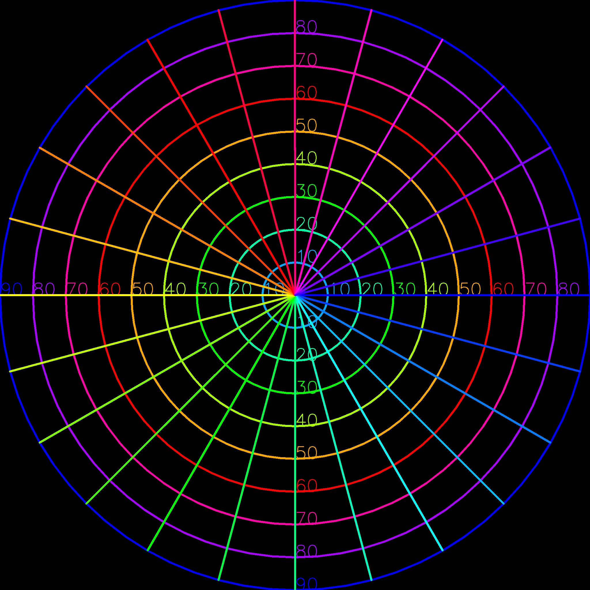
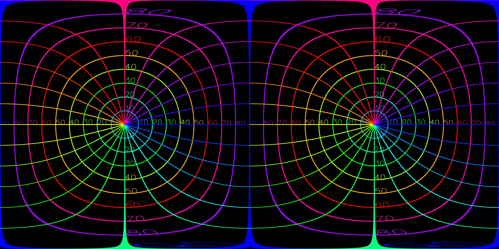

# VR180 image converter

<p align="center">
  <a href="https://github.com/34j/vr180-convert/actions/workflows/ci.yml?query=branch%3Amain">
    
  </a>
  <a href="https://vr180-convert.readthedocs.io">
    
  </a>
  <a href="https://codecov.io/gh/34j/vr180-convert">
    
  </a>
</p>
<p align="center">
  <a href="https://github.com/astral-sh/uv">
    
  </a>
  <a href="https://github.com/astral-sh/ruff">
    
  </a>
  <a href="https://github.com/j178/prek">
    
  </a>
</p>
<p align="center">
  <a href="https://pypi.org/project/vr180-convert/">
    
  </a>
  
  
</p>

---

**Documentation**: <a href="https://vr180-convert.readthedocs.io" target="_blank">https://vr180-convert.readthedocs.io </a>

**Source Code**: <a href="https://github.com/34j/vr180-convert" target="_blank">https://github.com/34j/vr180-convert </a>

---

Simple VR180 image converter on top of OpenCV and NumPy.

## Installation

Install this via pip (or your favourite package manager):

```shell
pipx install vr180-convert
```

## Usage

Simply run the following command to convert 2 fisheye images to a SBS equirectangular VR180 image:

```shell
v1c lr left.jpg right.jpg
```

| left.jpg                       | right.jpg                       | Output                                               |
| ------------------------------ | ------------------------------- | ---------------------------------------------------- |
|  |  |  |

If left and right image paths are the same, the image is divided into two halves (left and right, SBS) and processed as if they were separate images.

## Advanced usage

### Automatic image search

If one of left or right image path is a directory, the program will search for the closest image (in terms of creation time) in the other directory.

```shell
v1c lr left.jpg right_dir
v1c lr left_dir right.jpg
```

Since clocks on cameras may not be very accurate in some cases, it is recommended to check how quickly the clocks of the two cameras shift, and synchronize the clocks before shooting.
However, it can be adjusted by specifying `--time-calib` option.

```shell
v1c lr left.jpg right_dir --time-calib 1 # the clock of the right camera is 1 second faster / ahead
v1c lr left_dir right.jpg --time-calib 1 # the clock of the right camera is 1 second faster / ahead
```

### Radius estimation

The radius of the non-black area of the input image is assumed by counting black pixels by default, but it would be better to specify it manually to get stable results:

```shell
v1c lr left.jpg right.jpg --radius 1000
v1c lr left.jpg right.jpg --radius max # min(width, height) / 2
```

### Calibration

[Rotation matching using the least-squares method](https://lisyarus.github.io/blog/posts/3d-shape-matching-with-quaternions.html) can be performed by clicking corresponding points that can be regarded as infinitely far away from the camera.

- Using AKAZE as a feature matcher:

```shell
v1c lr left.jpg right.jpg --automatch fm
```

Since matching by AKAZE involves false detections, matching points with high loss are considered outliers, and the least-squares method is repeated multiple times to remove them.
Checking if the image should be swapped using feature matching might be theoretically possible but not implemented.

#### See Also

- [1.1.16. Robustness regression: outliers and modeling errors](https://scikit-learn.org/stable/modules/linear_model.html#robustness-regression-outliers-and-modeling-errors)

- Manually specifying the corresponding points using the GUI:

```shell
v1c lr left.jpg right.jpg --automatch gui
```

- Manually specifying the corresponding points using the CLI:

```shell
v1c lr left.jpg right.jpg --automatch "0,0;0,0;1,1;1,1" # left_x1,left_y1;right_x1,right_y1;...
```

$$
a_k, b_k \in \mathbb{R}^3,
\min_{R \in SO(3)} \sum_k \|R a_k - b_k\|^2
$$

Please also refer to the [Documentation](https://vr180-convert.readthedocs.io/en/latest/math.html) for mathematical details.

### Anaglyph

`--merge` option (which exports as [anaglyph](https://en.wikipedia.org/wiki/Anaglyph_3D) image) can be used to check if the calibration is successful by checking if the infinitely far points are overlapped.

```shell
v1c lr left.jpg right.jpg --automatch gui --merge
```

### Swap

If the camera is mounted upside down, you can simply use the `--swap` option without changing the transformer or other parameters:

```shell
v1c lr left.jpg right.jpg --swap
```

Or the image can be simply swapped using the `swap` command:

```shell
v1c swap rl.jpg
```

in case one notices that the left and right images are swapped after the conversion.

### Saving match visualization

When using `--automatch fm`, the match visualization can be saved by specifying `--savematch`.
The match image is saved alongside the output with a `.match` suffix.

```shell
v1c lr left.jpg right.jpg --automatch fm --savematch
```


### Custom conversion model

You can also specify the conversion model by adding Python code directly to the `--transformer` option:

```shell
v1c lr left.jpg right.jpg --transformer 'EquirectangularEncoder() * Euclidean3DRotator(from_rotation_vector([0, np.pi / 4, 0])) * FisheyeDecoder("equidistant")'
```

The expression is evaluated and used as the remapper chain, overriding the default pipeline.
Please refer to the [API documentation](https://vr180-convert.readthedocs.io/) for the available transformers and their parameters.
For `from_rotation_vector`, please refer to the [numpy-quaternion documentation](https://quaternion.readthedocs.io/en/latest/Package%20API%3A/quaternion/#from_rotation_vector).

### Single image conversion

To convert a single image, use `v1c s` instead.

### Running commands for all images in a directory

```shell
find left_dir -type f -name '*.jpg' -exec v1c lr {} right_dir --automatch fm --radius max --time-calib 0 --out-path out \;
```

### Help

For more information, please refer to the help or API documentation:

```shell
v1c --help
```

## Usage as a library

For more complex transformations, it is recommended to create your own `Remapper`.

Note that the transformation is applied in inverse order (new[(x, y)] = old[transform(x, y)], e.g. to decode [orthographic](https://en.wikipedia.org/wiki/Fisheye_lens#Mapping_function) fisheye images, `transform_polar` should be `arcsin(theta)`, not `sin(theta)`.)

```python
from typing import Any

from array_api.latest import Array
from vr180_convert.remapper.polar_roll import PolarRollRemapper
from vr180_convert.remapper.equidistant import EquirectangularEncoder
from vr180_convert.remapper.fisheye import FisheyeDecoder


class MyRemapper(PolarRollRemapper):
    def transform_polar(
        self, theta: Array, roll: Array, **kwargs: Any
    ) -> tuple[Array, Array]:
        return theta**0.98 + theta**1.01, roll


transformer = EquirectangularEncoder() * MyRemapper() * FisheyeDecoder("equidistant")
```

## Tips

### How to determine which image is left or right

<!--
- In the left image, the subject faces more to the right.
- In the right image, the subject faces more to the left.
- In other words, in a SBS image, the subject is oriented toward the center.

In anaglyph images,

- The left eye is covered with a red film, so the portion for the left eye is shown in blue.
- The right eye is covered with a blue film, so the portion for the right eye is shown in red.
| Film Color          | <span style="color:red">Red</span>   | <span style="color:blue">Blue</span> |
| Anaglyph Color      | <span style="color:blue">Blue</span> | <span style="color:red">Red</span>   |
-->

|                     | Left                        | Right                       |
| ------------------- | --------------------------- | --------------------------- |
| Subject Orientation | Right                       | Left                        |
| Film Color          | ${\color{red}\text{Red}}$   | ${\color{blue}\text{Blue}}$ |
| Anaglyph Color      | ${\color{blue}\text{Blue}}$ | ${\color{red}\text{Red}}$   |

- In a SBS image, the subject is oriented toward the center.

### How to edit images

This program cannot read RAW files. To deal with white-outs, etc., it is required to process each image with a program such as Photoshop, Lightroom, [RawTherapee](https://rawtherapee.com/downloads/), [Darktable](https://www.darktable.org/install/), etc.

However, this is so exhaustive, so it is recommended to take the images with JPEG format with care to **avoid overexposure** and to **match the settings** of the two cameras, then convert them with this program and edit the converted images.

<details>
<summary>Example of editing in RawTherapee (Light editing)</summary>

1. Rank the left images in RawTherapee.
2. Use this program to convert the images.
3. Edit the converted images in RawTherapee.

</details>

<details>
<summary>Example of editing in Photoshop (Exquisite editing)</summary>

1. Rank the left images in RawTherapee or Lightroom.
2. Open left image as a Smart Object `LRaw`.
3. Add right image as a Smart Object `RRaw`.
4. Make **minimal** corrections just to match the exposure using `Camera Raw Filter`.
5. Make each Smart Object into Smart Objects (`L`, `R`) again and do any image-dependent processing, such as removing the background.
6. Make both images into a single Smart Object (`P`) and process them as a whole.
7. Export as a PNG file.
8. Hide the other Smart Object (`L` or `R`) (created in step 3) in the Smart Object `P` (created in step 4) and save the Smart Object `P`, then export as a PNG file.
9. Use this program to convert the images.

</details>

## Contributors ✨

Thanks goes to these wonderful people ([emoji key](https://allcontributors.org/docs/en/emoji-key)):

<!-- prettier-ignore-start -->
<!-- ALL-CONTRIBUTORS-LIST:START - Do not remove or modify this section -->
<!-- markdownlint-disable -->
<!-- markdownlint-enable -->
<!-- ALL-CONTRIBUTORS-LIST:END -->
<!-- prettier-ignore-end -->

This project follows the [all-contributors](https://github.com/all-contributors/all-contributors) specification. Contributions of any kind welcome!

## Credits

[](https://github.com/copier-org/copier)

This package was created with
[Copier](https://copier.readthedocs.io/) and the
[browniebroke/pypackage-template](https://github.com/browniebroke/pypackage-template)
project template.
